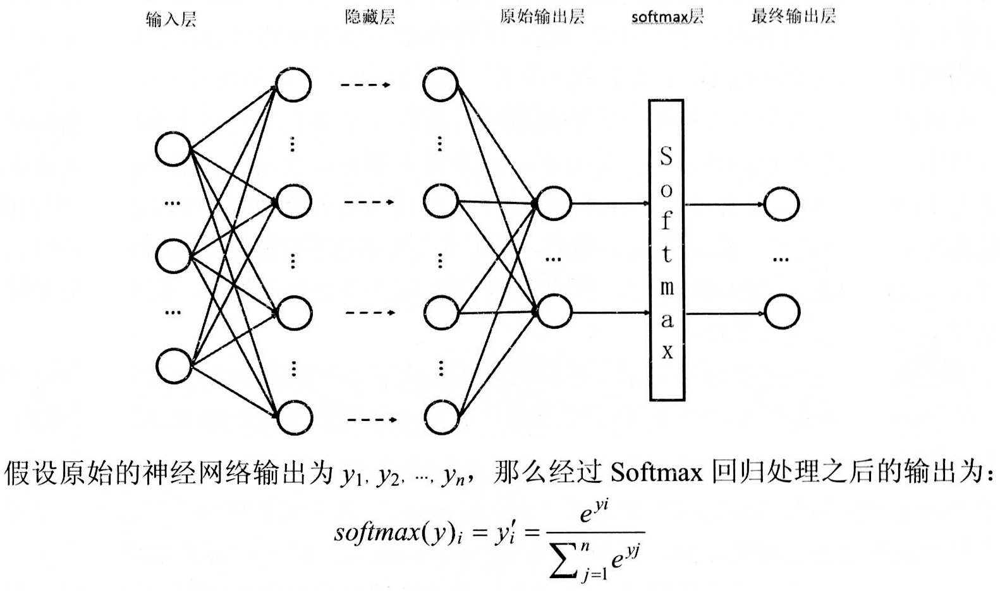
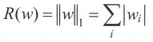
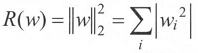
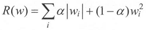

# 神经网络

- [playground](http://playground.tensorflow.org/)

## [hello](hello.py)

- 初识神经网络

## [learning_rate](learning_rate.py)

学习率既不能过大，也不能过小。
过小，训练速度慢；过大，可能导致模型震荡。
为了解决设定学习率的问题，Tensorflow提供了一种更加灵活的学习率设置方法一一指数衰减法。

- 学习速率
- 指数衰减法

## activation function

引入激活函数是为了**增加神经网络模型的非线性**。没有激活函数的每层都相当于矩阵相乘。
如果不用激活函数，每一层输出都是上层输入的线性函数，无论神经网络有多少层，输出都是输入的线性组合，这种情况就是最原始的感知机。


```python
tf.nn.relu(features=DATA)
tf.nn.sigmoid(x=DATA)
tf.nn.tanh(x=DATA)
```

## bias


## loss function / cost function

用来判断模型的预测值与真实值的不一致程度。

### cross entropy

判断一个输出向量和期望的向量有多接近。
两个概率分布p和q，通过q来表示p的交叉熵为：


```python
cross_entropy = tf.nn.softmax_cross_entropy_with_logits(labels=期望值,logits=预测值)
cross_entropy = tf.nn.sigmoid_cross_entropy_with_logits(labels=期望值,logits=预测值)
```

### softmax

分类问题



### mse(mean squared error)

回归问题


```python
mse = tf.reduce_mean(tf.square(期望值 - 预测值))
```

## regularization

假设用于刻画模型在训练数据上表现的损失函数为J(θ)，那么在优化时不是直接优化J(θ)，而是优化J(θ)+λR(w)。其中R(w）刻画的是模型的复杂程度，而λ表示模型复杂损失在总损失中的比例。θ表示的是一个神经网络中所有的参数，它包括边上的权重w和偏置项b。

基本的思想是希望通过限制权重的大小，使得模型不能任意拟合训练数据中的随机噪音。

### L1正则化

L1正则化会让参数变得更稀疏，即会有更多的参数变为0。



### L2正则化



### L1 + L2



```python
# J(θ)+λR(w)
tf.contrib.layers.l1_regularizer(λ)(w)
tf.contrib.layers.l2_regularizer(λ)(w)
tf.contrib.layers.l1_l2_regularizer(λ)(w)
```

## ema(exponential moving average)

是一个使模型在测试数据上更健壮的方法。
在采用随机梯度下降算法训练神经网络时，使用滑动平均模型可以在一定程度提高最终模型在测试数据上的表现。

```python
"""
    shadow_variable = decay * shadow_variable + (1 - decay) * variable
        shadow_variable: 影子变量
        variable: 待更新的变量
        decay: 衰减率（一般为0.999或0.9999）
        num_updates(optional): 动态设置decay大小
            decay = min(decay, (1+num_updates)/(10+num_updates))
"""
tf.train.ExponentialMovingAverage  # class
```

## [gradient decent]()