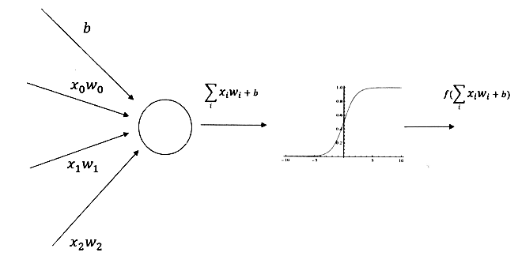
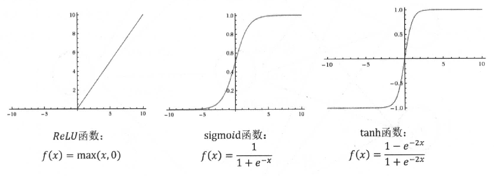
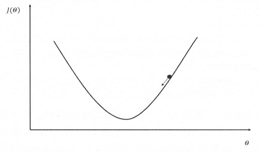
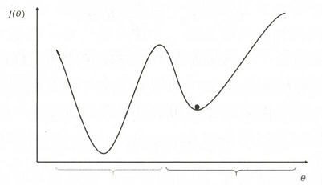

# 神经网络

- [MathJax Plugin for Github](https://chrome.google.com/webstore/detail/github-with-mathjax/ioemnmodlmafdkllaclgeombjnmnbima)
- [playground](http://playground.tensorflow.org/)

## [hello](hello.py)

- 初识神经网络

## weight & bias



## [learning_rate](learning_rate.py)

>学习率既不能过大，也不能过小。
>过小，训练速度慢；过大，可能导致模型震荡。
>为了解决设定学习率的问题，Tensorflow提供了一种更加灵活的学习率设置方法一一指数衰减法。

### 指数衰减法

```python
# decayed_learning_rate = learning_rate * decay_rate ^ (global_step / decay_steps)
    # decayed_learning_rate: 每轮实际使用的学习率
    # learning_rate: 初始学习率
    # global_step: tf.Variable(0, trainable=False)，用以记录训练次数
    # decay_steps: 衰减速度
    # decay_rate: 衰减系数
    # staircase: 是否以离散间隔衰减学习速率
    #     staircase为真时(global_step / decay_steps)的值会被转化为整数
learning_rate = tf.train.exponential_decay(
    learning_rate,
    global_step,
    decay_steps,
    decay_rate,
    staircase=False
)
```

## activation function

>引入激活函数是为了**增加神经网络模型的非线性**。没有激活函数的每层都相当于矩阵相乘。
>如果不用激活函数，每一层输出都是上层输入的线性函数，无论神经网络有多少层，输出都是输入的线性组合，这种情况就是最原始的感知机。



```python
tf.nn.relu(features=DATA)
tf.nn.sigmoid(x=DATA)
tf.nn.tanh(x=DATA)
```

## loss function / cost function

>损失函数用来判断模型的预测值与真实值的不一致程度。
>被训练参数将会朝着损失函数值最小的方向移动。

### Cross-Entropy

两个概率分布p和q，通过q来表示p的交叉熵为：
$H(p,q)=-\sum\limits_{X}^{}p(x)\log\ q(x)$

交叉熵用来刻画两个概率分布之间的距离。
当交叉熵作为神经网络的损失函数时，p代表的是**目标值**，q代表的是**预测值**。
交叉熵越小两个概率分布越接近。
交叉熵函数不是对称的：$H(p,q)≠H(q,p)$

```python
# tf.clip_by_value: 避免出现log0或大于log1的概率。
cross_entropy = -tf.reduce_mean(
    目标值 * tf.log(tf.clip_by_value(预测值, 1e-10, 1.0)) + 
    ...
)
```

### Softmax

将神经网络的输出变成一个概率分布。

$softmax(y)_i=\dfrac{e^{y_i}}{\sum\nolimits_{j=1}^{n}e^{y_j}}$

原始神经网络的输出被用作置信度来生成新的输出。

```python
# 交叉熵常与Softmax一起使用
cross_entropy = tf.nn.softmax_cross_entropy_with_logits(labels=目标值, logits=预测值)
```

### MSE(mean squared error)

回归问题

- $y_i$：目标值
- $y_i'$：预测值

$MSE(y,y')=\dfrac{\sum\nolimits_{i=1}^{n}(y_i-y_i')^2}{n}$

```python
mse = tf.reduce_mean(tf.square(目标值 - 预测值))
```

## regularization

>正则化通过限制权重的大小，使得模型不能任意拟合训练数据中的随机噪音。

>对于线性回归模型，使用L1正则化的模型建叫做Lasso回归
>使用L2正则化的模型叫做Ridge回归

$loss=J(θ)+λR(θ)$

- $J(θ)$：未加入正则化时的损失函数
- $λR(θ)$：正则化惩罚项

### L1

L1正则化会让参数变得更稀疏，即会有更多的参数变为0。

$R(W)=\|{w}\|_1=\sum\limits_i|w_i|$

### L2

$R(W)=\|{w}\|_2^2=\sum\limits_i|w_i^2|$

### L1 + L2

$R(W)=\sum\limits_i{α|w_i|+(1-α)|w_i^2|}$

```python
tf.contrib.layers.l1_regularizer(λ)(w)
tf.contrib.layers.l2_regularizer(λ)(w)
tf.contrib.layers.l1_l2_regularizer(λ)(w)
```

## exponential moving average

>滑动平均模型用来估计变量的局部均值，使得变量的更新与一段时间内的历史取值有关。
>在采用随机梯度下降算法训练神经网络时，使用滑动平均模型可以在一定程度提高最终模型在测试数据上的表现。

ExponentialMovingAverage对每一个变量会维护一个影子变量（shadow variable），这个影子变量的初始值就是相应变量的初始值，每次运行时，影子变量的值按`shadow_variable = decay * shadow_variable + (1 - decay) * variable`更新。

```python
# shadow_variable = decay * shadow_variable + (1 - decay) * variable
    # shadow_variable:        影子变量
    # variable:               待更新的变量
    # decay:                  衰减率，决定更新速度（一般为0.999或0.9999）
    # num_updates(optional):  动态设置decay大小
    #     decay = min(decay, (1+num_updates)/(10+num_updates))
ema = tf.train.ExponentialMovingAverage(decay=衰减率, num_updates=None)
...
# x = activation(tf.matmul(x, weight) + biases)
x = activation(tf.matmul(x, ema.average(weight)) + ema.average(biases))

```

## [gradient decent](gradient_decent.py)



$θ_{n+1}=θ_n-η\dfrac{∂}{∂θ_n}J(θ_n)$



梯度下降算法并不能保证被优化的函数达到全局最优解。

```python
train_times = 训练次数
learning_rate = 学习速率
loss = 损失函数
DATA_X = 特征值
DATA_Y = 目标值
dataset_size = 样本数量
batch_size = 每组数量
# ----------------------
train_adam = tf.train.AdamOptimizer(learning_rate).minimize(loss)
for i in range(1, 1 + train_times):
    batch_X, batch_Y = next_batch(DATA_X, DATA_Y, i, dataset_size, batch_size)
    sess.run(train_adam, feed_dict={input_x: batch_X, input_y: batch_Y})
```

