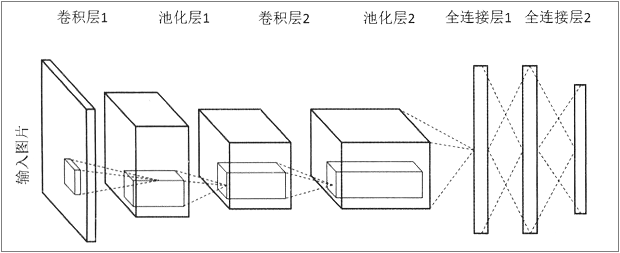
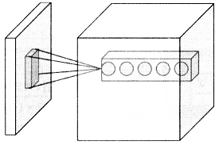
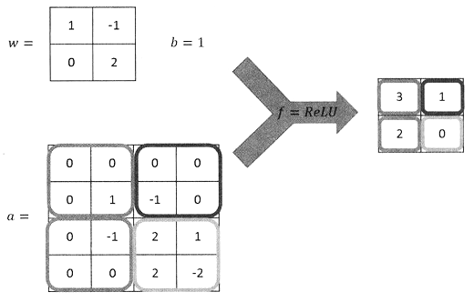

# CNN

## [hello](./hello.py)

- 初识卷积

### 卷积层（Convolution）

卷积层试图将神经网络中的每一小块进行更加深入地分析从而得到抽象程度更高的特征。一般来说，通过卷积层处理过的节点矩阵会变得更深。

#### 过滤器（Filter）

**过滤器的参数深度**与输入数据深度是一致的。

- **过滤器尺寸**：输入节点矩阵的大小，一般为`3×3`、`5×5`。
- **过滤器深度**：输出单位节点矩阵的深度。

$$ReLU\left((\sum_{i=1}^{deep} area_i \cdot filter_i) + biases\right)$$

过滤器每层与输入数据每层求内积并计算和最后加上偏置项就得到输出矩阵上的一个点。

### 池化层（Pooling）