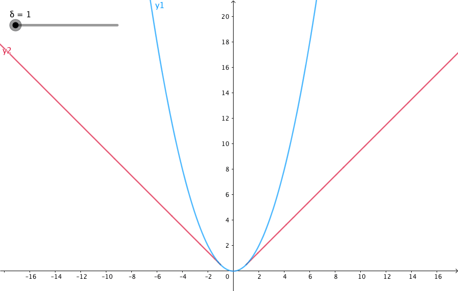

## Loss

### 回归问题

#### 均方误差（MSE）

$$\mathrm{MSE}(y, f(x)) = \dfrac{\sum\limits_{i=1}^{n}(y_i-f(x_i))^2}{n}$$

- 优点是便于梯度下降，误差大时下降快，误差小时下降慢，有利于函数收敛。
- 缺点是受明显偏离正常范围的离群样本的影响较大

```py
loss_mse1 = tf.losses.mean_squared_error(y_true, y_pred)
loss_mse2 = tf.reduce_mean(tf.square(y_true - y_pred))

with tf.Session().as_default():
    print(loss_mse1.eval())
    print(loss_mse2.eval())
```

#### 平均绝对误差（MAE）

$$\mathrm{MAE}(y, f(x)) = \dfrac{\sum\limits_{i=1}^{n}|y_i-f(x_i)|}{n}$$

- 优点是其克服了MSE的缺点，受偏离正常范围的离群样本影响较小。
- 缺点是收敛速度比MSE慢，因为当误差大或小时其都保持同等速度下降，而且在某一点处还不可导，计算机求导比较困难。

```py
loss_mae1 = tf.reduce_sum(tf.losses.absolute_difference(y_true, y_pred))
loss_mae2 = tf.reduce_sum(tf.reduce_mean(tf.abs(y_pred - y_true)))

with tf.Session().as_default():
    print(loss_mae1.eval())
    print(loss_mae2.eval())
```

#### Huber

>[Sklearn关于Huber的文档](https://scikit-learn.org/stable/modules/linear_model.html#huber-regression)中建议将$δ=1.35$以达到$95\%$的有效性。

$$L_σ(y, f(x)) = \begin{cases}
    \dfrac{1}{2}(y-f(x))^2    & |y-f(x)|≤σ
\\  σ(|y-f(x)|-\dfrac{1}{2}σ) & otherwise
\end{cases}$$



检测真实值和预测值之差的绝对值在超参数δ内时，使用MSE来计算loss,在δ外时使用MAE计算loss。

```py
loss_huber = tf.reduce_sum(tf.losses.huber_loss(y_true, y_pred))

with tf.Session().as_default():
    print(loss_huber.eval())
```

### 分类问题

#### Cross Entropy

$$\mathrm{CEH}(p, q) = -\sum_{x∈X} p(x)\log q(x)$$

**模拟自带CE**

```py
import tensorflow as tf


with tf.Session() as sess:
    epsilon = 1e-7

    loss1 = tf.losses.log_loss(y_true, y_pred, epsilon=epsilon, reduction=tf.losses.Reduction.MEAN)
    print('log_loss', sess.run(loss1))

    loss2 = -tf.reduce_mean(
        y_true * tf.log(y_pred + epsilon) +
        (1 - y_true) * tf.log(1 - y_pred + epsilon)
    )
    print('+epsilon', sess.run(loss2))

    loss3 = -tf.reduce_mean(
        y_true * tf.log(tf.clip_by_value(y_pred, epsilon, 1))
        +
        (1 - y_true) * tf.log(tf.clip_by_value(1 - y_pred, epsilon, 1))
    )
    print('clip__by', sess.run(loss3))
```

**自定义CE**

```py
import numpy as np
import tensorflow as tf


def to_probability(y, epsilon):
    """
    转换为概率分布
    :param y:
    :param epsilon:
    :return:
    """
    if isinstance(y, tf.Tensor):
        __fun_reshape = tf.reshape
        __fun_clip = tf.clip_by_value
        __fun_sum = tf.reduce_sum
        __fun_concat = (lambda x1, x2: tf.concat([x1, x2], axis=1))
    else:
        __fun_reshape = np.reshape
        __fun_clip = np.clip
        __fun_sum = np.sum
        __fun_concat = (lambda x1, x2: np.hstack([x1, x2]))

    y = __fun_clip(y, epsilon, 1. - epsilon)
    if 1 == len(y.shape):
        y = __fun_reshape(y, (-1, 1))
    if 1 == y.shape[-1]:
        y = __fun_concat(y, 1-y)
    return y / __fun_sum(y, axis=len(y.shape) - 1, keepdims=True)


def cross_entropy(y_true, y_pred, epsilon=None):
    assert y_true.shape == y_pred.shape
    epsilon = 1e-7 if epsilon is None else epsilon
    if isinstance(y_true, list):
        y_true = np.array(y_true)
    if isinstance(y_pred, list):
        y_pred = np.array(y_pred)
    if isinstance(y_true, tf.Tensor):
        __fun_log = tf.log
        __fun_sum = tf.reduce_sum
        __fun_float64 = (lambda x: tf.cast(x, tf.float64))
    else:
        __fun_log = np.log
        __fun_sum = np.sum
        __fun_float64 = (lambda x: x.astype(np.float64))
    if y_true.dtype != y_pred.dtype:
        y_true = __fun_float64(y_true)
        y_pred = __fun_float64(y_pred)
    y_true = __fun_float64(y_true)
    y_pred = to_probability(y_pred, epsilon)

    return (
        # binary_cross_entropy
        -(
            y_true * __fun_log(y_pred[:, 0]) + (1. - y_true) * __fun_log(y_pred[:, 1])
        )
        if 1 == len(y_true.shape) or 1 == y_true.shape[-1] else
        # categorical_cross_entropy
        -(
            __fun_sum(y_true * __fun_log(y_pred), axis=len(y_pred.shape) - 1)
        )
    )


if __name__ == '__main__':
    from sklearn.metrics import log_loss
    # y_true = ...
    # y_pred = ...
    with tf.Session() as sess:
        _epsilon = 1e-7
        print(log_loss(_true, _pred, eps=_epsilon, normalize=False))
        print(np.sum(cross_entropy(_true, _pred, _epsilon)))
        print(np.sum(sess.run(cross_entropy(tf.constant(_true), tf.constant(_pred), _epsilon))))
```

#### Sigmoid Cross Entropy

先求Sigmoid再求CrossEntropy，适用于二分类问题。

```py
loss = tf.reduce_mean(tf.nn.sigmoid_cross_entropy_with_logits(labels=y_true, logits=y_pred))
```

#### Softmax Cross Entropy

先求Softmax再求CrossEntropy，适用于多分类问题。

```py
loss = tf.reduce_mean(tf.nn.softmax_cross_entropy_with_logits(labels=y_true, logits=y_pred))
```
