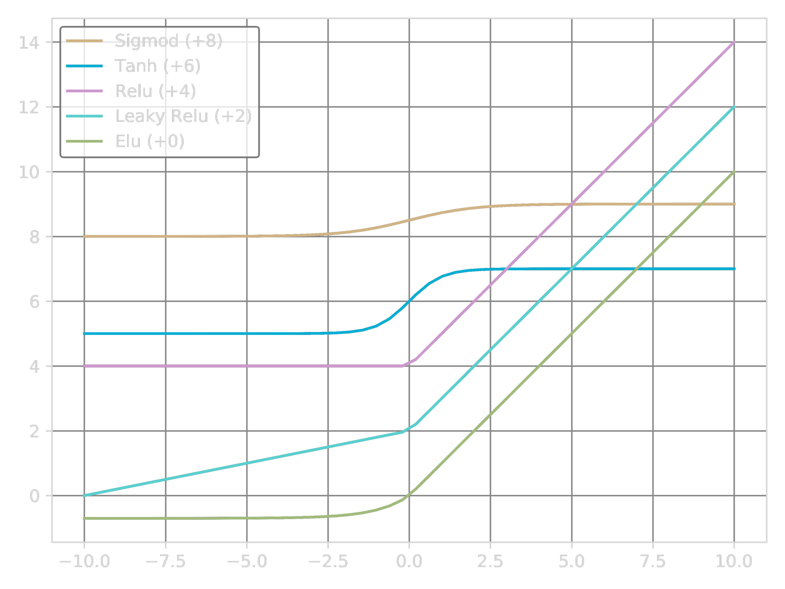
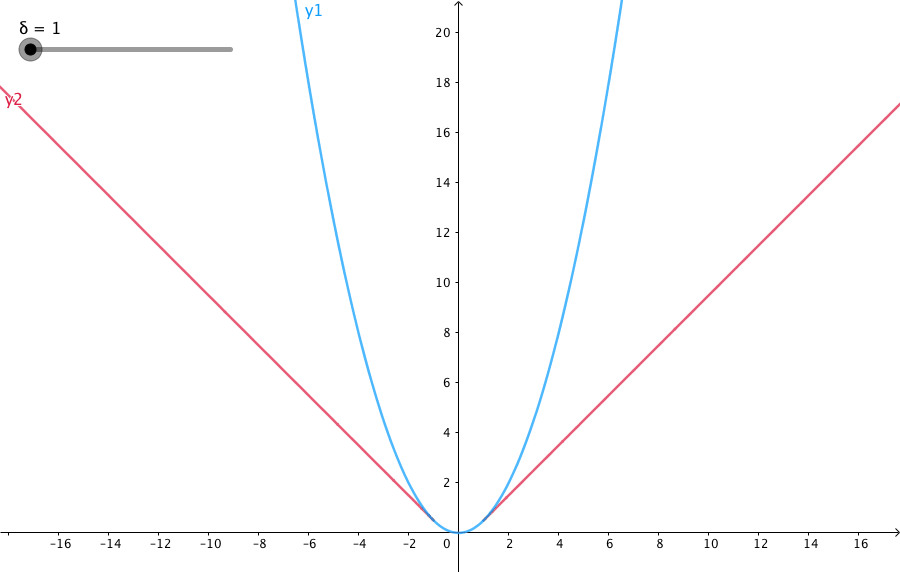

<link rel="stylesheet" href="https://zhmhbest.gitee.io/hellomathematics/style/index.css">
<script src="https://zhmhbest.gitee.io/hellomathematics/style/index.js"></script>

# [Tensorflow](../index.html)

[TOC]

## Hello

```py
import tensorflow as tf

# Tensor
a = tf.constant(1)
b = tf.constant(2)
result = tf.add(a, b)
print(result)


# Session
with tf.Session() as sess:
    print(sess.run(result))
```

## Tensor

- $0$阶张量：标量（*Scalar*）也就是$1$个实数
- $1$阶张量：向量（*Vector*）也就是$1$维数组
- $2$阶张量：矩阵（*Matrix*）也就是$2$维数组
- $n$阶张量：$n$维数组

### 张量的属性

**定义一个常量张量**

```py
tensor_constant_demo = tf.constant([
    [1.1, 2.2, 3.3],
    [4.4, 5.5, 6.6]
], name='tensor_constant_demo', dtype=tf.float32)
```

**Operation（OP，运算）**：节点在图中被称为OP，OP即某种抽象计算。

```py
print(tensor_constant_demo.op)
print("name" , tensor_constant_demo.name)
print("type" , tensor_constant_demo.dtype)
print("shape", tensor_constant_demo.shape)
print("graph", tensor_constant_demo.graph)
```

### 调整张量

```py
# 类型转换
result_cast = tf.cast(tensor_constant_demo, tf.int32, name='result_cast')
print(tensor_constant_demo.dtype, '=>', result_cast.dtype)

# 结构调整
result_reshape = tf.reshape(tensor_constant_demo, [3, 2], name='result_reshape')
print(tensor_constant_demo.shape, '=>', result_reshape.shape)
```

### 序列张量

```py
# 从1开始步长为3不超过10的序列
tensor_range = tf.range(1, 10, 3, dtype=None, name=None)
'''
    [1 4 7]
'''

# 10~100等分为5份
tensor_space = tf.linspace(10.0, 100.0, 5, name=None)
'''
    [10.0 32.5 55.0 77.5 100.0]
'''
```

### 填充张量

```py
# 产生以给定值填充的张量
tensor_fill = tf.fill([2, 3], 99, name=None)
'''
[[99 99 99]
 [99 99 99]]
'''

# 产生以0填充的张量
tensor_zeros = tf.zeros([2, 3], tf.float32, name=None)
'''
[[0. 0. 0.]
 [0. 0. 0.]]
'''

# 产生以1填充的张量
tensor_ones = tf.ones([2, 3], tf.float32, name=None)
'''
[[1. 1. 1.]
 [1. 1. 1.]]
'''

# 产生对角线为[1, 2, 3, 4]其余为0的二维张量
tensor_diag = tf.diag([1, 2, 3, 4], name=None)
'''
[[1 0 0 0]
 [0 2 0 0]
 [0 0 3 0]
 [0 0 0 4]]
'''
```

### 随机数张量

```py
# 正态分布随机数(shape, mean:平均数, stddev:标准差)
tensor_random1 = tf.random_normal([2, 3], 10, 0.6, name=None)
'''
[[9.929678 9.88656  9.663629]
 [9.634826 9.379279 9.33766 ]]
'''

# 正态分布随机数，偏离2个标准差的随机值会被重新生成
tensor_random2 = tf.truncated_normal([2, 3], 10, 0.6, name=None)
'''
[[10.298693 10.121988 10.665423]
 [10.015184 10.673774 10.18005 ]]
'''

# 均匀分布随机数(shape, min, max)
tensor_random3 = tf.random_uniform([2, 3], 1, 10, name=None)
'''
[[8.568491  6.56831   2.8412023]
 [3.7498274 4.389385  8.6796055]]
'''

# Γ(Gamma)随机数(shape, alpha, beta)
# tf.random_gamma(...)
```

## Session

```py
a = tf.constant(1, name="a")
b = tf.constant(2, name="b")
result = tf.add(a, b)
print(result)
# Tensor("Add:0", shape=(), dtype=int32)
```

### 一般会话

```py
with tf.Session() as sess:
    # 方式1
    print(sess.run(result))
    # 方式2
    print(result.eval(session=sess))
```

### 默认会话

```py
with tf.Session().as_default():
    print(result.eval())
```

### 交互会话

该方法一般用在命令窗口中。

```py
sess = tf.InteractiveSession()
print(result.eval())
sess.close()
```

### 配置会话

```py
"""
    log_device_placement: 打印设备信息
    allow_soft_placement: GPU异常时，可以调整到CPU执行
"""
with tf.Session(config=tf.ConfigProto(log_device_placement=True, allow_soft_placement=True)) as sess:
    print(sess.run(result))
```

### 运行时数据

```py
X = tf.placeholder(tf.float32, shape=(None, 2))  # 样本组数不固定，每组两个
Y = X * 3
with tf.Session() as sess:

    # → print(sess.run(Y))
    # ↑ InvalidArgumentError: 此处X还没有赋值

    print(sess.run(Y, feed_dict={
        X: [
            [1, 2],
            [2, 3]
        ]
    }))

    print(sess.run(Y, feed_dict={
        X: [
            [1, 2],
            [2, 3],
            [5, 3]
        ]
    }))
```

## Variable

### 定义变量

```py
# 方式1
var1 = tf.Variable(99, name='var1')
var2 = tf.Variable(tf.random_normal([2, 3], mean=10, stddev=2), name='var2')

# 方式2
var3 = tf.get_variable('var3', initializer=tf.zeros_initializer(), shape=[2])
var4 = tf.get_variable('var4', initializer=tf.ones_initializer(), shape=[3])
```

当设置`reuse=True`时，`get_variable`可以防止重复定义。
此外，当使用`get_variable`方法时，变量只能以

- `tf.constant_initializer()`
- `tf.random_normal_initializer()`
- `tf.truncated_normal_initializer()`
- `tf.random_uniform_initializer()`
- `tf.uniform_unit_scaling_initializer()`
- `tf.zeros_initializer()`
- `tf.ones_initializer()`

等方法初始化。

### 使用变量

在使用变量前，必须初始化变量，我们可以采取`sess.run(var1.initializer)`方法只初始化在本次会话中要用到的变量，也可以使用`tf.global_variables_initializer().run()`或`sess.run(tf.global_variables_initializer())`方法直接初始化全部变量。

```py
with tf.Session() as sess:
    # 使用前，必须初始化变量
    sess.run(var1.initializer)
    sess.run(var3.initializer)

    # 获得变量的值
    print(sess.run(var1))
    # print(sess.run(var2))  # var1 未被初始化，使用会报错。

    with tf.variable_scope("", reuse=True):
        print(sess.run(tf.get_variable("var3")))
        # print(sess.run(tf.get_variable("var4")))  # var4 未被初始化，使用会报错。
```

```py
with tf.Session() as sess:
    # 初始化全部变量
    tf.global_variables_initializer().run()
    # sess.run(tf.global_variables_initializer())

    # 获得变量的值
    print(sess.run(var1))
    print(sess.run(var2))
    print()
    with tf.variable_scope("", reuse=True):
        print(sess.run(tf.get_variable("var3")))
        print(sess.run(tf.get_variable("var4")))
```

### 变量空间

```py
"""
创建变量
"""
# 创建变量 space1.var1 = 0
with tf.variable_scope("space1"):
    tf.get_variable('var1', initializer=tf.zeros_initializer(), shape=[1])

# 创建变量 space2.var1 = 1
with tf.variable_scope("space2"):
    tf.get_variable('var1', initializer=tf.ones_initializer(), shape=[1])

"""
使用变量
"""
with tf.Session() as sess:
    # 初始化全部变量
    tf.global_variables_initializer().run()

    with tf.variable_scope("space1", reuse=True):
        print(sess.run(tf.get_variable("var1")))

    with tf.variable_scope("space2", reuse=True):
        print(sess.run(tf.get_variable("var1")))
```

## Graph

### 默认图

当我们没有指定图时，Tensorflow会为我们提供一张默认的图，此时，我们的张量、会话、变量都是运行在默认的图上。

```py
g0 = tf.get_default_graph()  # 获取默认的图
a = tf.constant([1.0, 2.0], name="a")
b = tf.constant([2.0, 3.0], name="b")
result = a + b

print(a.graph is g0)
print(b.graph is g0)
print(result.graph is g0)
```

### 自定义图

```py
g0 = tf.get_default_graph() 
g1 = tf.Graph()
print("g0 is default?", tf.get_default_graph() is g0)               # True
print("g1 is default?", tf.get_default_graph() is g1)               # False

with g1.as_default():
    print("\t", "g1 is default?", tf.get_default_graph() is g1)     # True
    # g1中定义变量，并赋值
    var1 = tf.Variable(1, name='var1')
    print("\t", "var1 is in g1?", var1.graph is g1)                 # True
# end with(graph)

print("g0 is default?", tf.get_default_graph() is g0)               # True
print("g1 is default?", tf.get_default_graph() is g1)               # False
```

### 自定义图并运行会话

```py
g0 = tf.get_default_graph() 
g2 = tf.Graph()
with g2.as_default():
    print("\t", "g2 is default?", tf.get_default_graph() is g2)           # True
    var1 = tf.Variable(2, name='var1')
    """
        方式一
    """
    with tf.Session() as sess:
        tf.global_variables_initializer().run()
        print("\t", "g2 var1 = ", sess.run(var1))
    # end with(sess)
# end with(graph)

print("g0 is default?", tf.get_default_graph() is g0)               # True
print("g2 is default?", tf.get_default_graph() is g2)               # False

"""
    方式二
"""
with tf.Session(graph=g2) as sess:
    print("\t", "g2 is default?", tf.get_default_graph() is g2)           # True
    tf.global_variables_initializer().run()
    print("\t", "g2 var1 = ", sess.run(var1))
# end with(sess)
```

## TensorBoard

### 封装

```py
import os
import tensorflow as tf


class TensorBoard:
    def __init__(self, summary_dir="./summary"):
        assert os.path.isdir(os.path.dirname(summary_dir)) is True  # 上级目录存在
        if os.path.exists(summary_dir):
            assert os.path.isdir(summary_dir) is True  # 指定目录不是文件
        else:
            os.makedirs(summary_dir)
        # end if
        self.summary_dir = os.path.abspath(summary_dir)

    def remake(self):
        os.system('RMDIR /S /Q "' + self.summary_dir + '"')
        os.system('MKDIR "' + self.summary_dir + '"')

    def save(self, g):
        tf.summary.FileWriter(self.summary_dir, graph=g)

    def board(self):
        print("TensorBoard may view at:")
        print(" * http://%s:6006/" % os.environ['ComputerName'])
        print(" * http://localhost:6006/")
        print(" * http://127.0.0.1:6006/")
        os.system('tensorboard --logdir="' + self.summary_dir + '"')
```

### 使用

```py
a = tf.constant(5.0, name="a")
b = tf.constant(6.0, name="b")
c = tf.add(a, b, name='c')

tb = TensorBoard()
with tf.Session() as sess:
    tb.save(sess.graph)
tb.board()
```

## Activate

将非线性特性引入到我们的网络中。

```py
import matplotlib.pyplot as plt
import numpy as np

x = np.linspace(-10, 10)
y_sigmoid = 1 / (1 + np.exp(-x))
y_tanh = (np.exp(x) - np.exp(-x)) / (np.exp(x) + np.exp(-x))
y_relu = np.array([0 if item < 0 else item for item in x])
alpha_relu = 0.2
y_leaky_relu = np.array([alpha_relu * item if item < 0 else item for item in x])
alpha_elu = 0.7
y_elu = np.array([alpha_elu*(np.exp(item)-1) if item < 0 else item for item in x])

plt.figure(dpi=600)

plt.plot(x, 8+y_sigmoid, label='Sigmoid (+8)')
plt.plot(x, 6+y_tanh, label='Tanh (+6)')
plt.plot(x, 4+y_relu, label='Relu (+4)')
plt.plot(x, 2+y_leaky_relu, label='Leaky Relu (+2)')
plt.plot(x, 0+y_elu, label='Elu (+0)')

plt.grid()
plt.legend()
plt.show()
```



### Sigmoid

$$f(x) = \dfrac{1}{1 + e^{-x}}$$

```py
tf.nn.sigmoid(x)
```

### Tanh

$$f(x) = \dfrac{e^{x} - e^{-x}}{e^{x} + e^{-x}}$$

```py
tf.nn.tanh(x)
```

### ReLU

$$f(x) = \max(0, x)$$

```py
tf.nn.relu(x)
```

### Leaky ReLU

$$f(x) = \begin{cases}
    x   & x≥0
\\  αx  & x<0
\end{cases}$$

```py
tf.nn.leaky_relu(x, alpha=0.2)
```

### ELU

$$f(x) = \begin{cases}
    x           & x≥0
\\  α(e^x-1)    & x<0
\end{cases}$$

- $α$：ELU负值部分在何时饱和。

```py
tf.nn.elu(x, alpha=0.2)
```

### Softmax

把一个序列，变成概率。Softmax是一种非常明显的**马太效应**（强的更强，弱的更弱）。但是这种方法非常的不稳定。因为要算指数，只要输入稍微大一点，则在计算上一定会溢出。

$$\mathrm{Softmax}\left(
    \left[\begin{array}{c} a_1 \\ a_2 \\ \vdots \\ a_n \end{array}\right]
\right) =\left[\begin{array}{c}
    \dfrac{e^{a_1}}{\sum_{i=1}^{n}e^{a_i}}
&   \dfrac{e^{a_2}}{\sum_{i=1}^{n}e^{a_i}}
&   \cdots
&   \dfrac{e^{a_n}}{\sum_{i=1}^{n}e^{a_i}}
\end{array}\right]^T$$

```py
def softmax(x):
    exps = np.exp(x)
    return exps / np.sum(exps)
```

```py
tf.nn.softmax(logits)
```

#### Softmax变体

```py
def stablesoftmax(x):
    shiftx = x - np.max(x)
    exps = np.exp(shiftx)
    return exps / np.sum(exps)
```

## Loss

### 回归问题

**测试数据**

```py
y_true = tf.constant([
    12, 23, 94, 37
], dtype=tf.float32, name='y_true')  # mean=41.5

y_pred = tf.constant([
    24, 32, 66, 53
], dtype=tf.float32, name='y_pred')  # mean=43.75
```

#### 均方误差（MSE）

$$\mathrm{MSE}(y, f(x)) = \dfrac{\sum\limits_{i=1}^{n}(y_i-f(x_i))^2}{n}$$

- 优点是便于梯度下降，误差大时下降快，误差小时下降慢，有利于函数收敛。
- 缺点是受明显偏离正常范围的离群样本的影响较大

```py
loss_mse1 = tf.losses.mean_squared_error(y_true, y_pred)
loss_mse2 = tf.reduce_mean(tf.square(y_true - y_pred))

with tf.Session().as_default():
    print(loss_mse1.eval())
    print(loss_mse2.eval())
```

#### 平均绝对误差（MAE）

$$\mathrm{MAE}(y, f(x)) = \dfrac{\sum\limits_{i=1}^{n}|y_i-f(x_i)|}{n}$$

- 优点是其克服了MSE的缺点，受偏离正常范围的离群样本影响较小。
- 缺点是收敛速度比MSE慢，因为当误差大或小时其都保持同等速度下降，而且在某一点处还不可导，计算机求导比较困难。

```py
loss_mae1 = tf.reduce_sum(tf.losses.absolute_difference(y_true, y_pred))
loss_mae2 = tf.reduce_sum(tf.reduce_mean(tf.abs(y_pred - y_true)))

with tf.Session().as_default():
    print(loss_mae1.eval())
    print(loss_mae2.eval())
```

#### Huber

>[Sklearn关于Huber的文档](https://scikit-learn.org/stable/modules/linear_model.html#huber-regression)中建议将$δ=1.35$以达到$95\%$的有效性。

$$L_σ(y, f(x)) = \begin{cases}
    \dfrac{1}{2}(y-f(x))^2    & |y-f(x)|≤σ
\\  σ(|y-f(x)|-\dfrac{1}{2}σ) & otherwise
\end{cases}$$



检测真实值和预测值之差的绝对值在超参数δ内时，使用MSE来计算loss,在δ外时使用MAE计算loss。

```py
loss_huber = tf.reduce_sum(tf.losses.huber_loss(y_true, y_pred))

with tf.Session().as_default():
    print(loss_huber.eval())
```

### 分类问题

#### Cross Entropy

$$\mathrm{CEH}(p, q) = -\sum_{x∈X} p(x)\log q(x)$$

**模拟自带CE**

```py
import tensorflow as tf


with tf.Session() as sess:
    epsilon = 1e-7

    loss1 = tf.losses.log_loss(y_true, y_pred, epsilon=epsilon, reduction=tf.losses.Reduction.MEAN)
    print('log_loss', sess.run(loss1))

    loss2 = -tf.reduce_mean(
        y_true * tf.log(y_pred + epsilon) +
        (1 - y_true) * tf.log(1 - y_pred + epsilon)
    )
    print('+epsilon', sess.run(loss2))

    loss3 = -tf.reduce_mean(
        y_true * tf.log(tf.clip_by_value(y_pred, epsilon, 1))
        +
        (1 - y_true) * tf.log(tf.clip_by_value(1 - y_pred, epsilon, 1))
    )
    print('clip__by', sess.run(loss3))
```

**自定义CE**

```py
import numpy as np
import tensorflow as tf


def to_probability(y, epsilon):
    """
    转换为概率分布
    :param y:
    :param epsilon:
    :return:
    """
    if isinstance(y, tf.Tensor):
        __fun_reshape = tf.reshape
        __fun_clip = tf.clip_by_value
        __fun_sum = tf.reduce_sum
        __fun_concat = (lambda x1, x2: tf.concat([x1, x2], axis=1))
    else:
        __fun_reshape = np.reshape
        __fun_clip = np.clip
        __fun_sum = np.sum
        __fun_concat = (lambda x1, x2: np.hstack([x1, x2]))

    y = __fun_clip(y, epsilon, 1. - epsilon)
    if 1 == len(y.shape):
        y = __fun_reshape(y, (-1, 1))
    if 1 == y.shape[-1]:
        y = __fun_concat(y, 1-y)
    return y / __fun_sum(y, axis=len(y.shape) - 1, keepdims=True)


def cross_entropy(y_true, y_pred, epsilon=None):
    assert y_true.shape == y_pred.shape
    epsilon = 1e-7 if epsilon is None else epsilon
    if isinstance(y_true, list):
        y_true = np.array(y_true)
    if isinstance(y_pred, list):
        y_pred = np.array(y_pred)
    if isinstance(y_true, tf.Tensor):
        __fun_log = tf.log
        __fun_sum = tf.reduce_sum
        __fun_float64 = (lambda x: tf.cast(x, tf.float64))
    else:
        __fun_log = np.log
        __fun_sum = np.sum
        __fun_float64 = (lambda x: x.astype(np.float64))
    if y_true.dtype != y_pred.dtype:
        y_true = __fun_float64(y_true)
        y_pred = __fun_float64(y_pred)
    y_true = __fun_float64(y_true)
    y_pred = to_probability(y_pred, epsilon)

    return (
        # binary_cross_entropy
        -(
            y_true * __fun_log(y_pred[:, 0]) + (1. - y_true) * __fun_log(y_pred[:, 1])
        )
        if 1 == len(y_true.shape) or 1 == y_true.shape[-1] else
        # categorical_cross_entropy
        -(
            __fun_sum(y_true * __fun_log(y_pred), axis=len(y_pred.shape) - 1)
        )
    )


if __name__ == '__main__':
    from sklearn.metrics import log_loss
    # y_true = ...
    # y_pred = ...
    with tf.Session() as sess:
        _epsilon = 1e-7
        print(log_loss(_true, _pred, eps=_epsilon, normalize=False))
        print(np.sum(cross_entropy(_true, _pred, _epsilon)))
        print(np.sum(sess.run(cross_entropy(tf.constant(_true), tf.constant(_pred), _epsilon))))
```

#### Sigmoid Cross Entropy

```py
loss1 = tf.reduce_mean(tf.nn.sigmoid_cross_entropy_with_logits(labels=y_true, logits=y_pred))
# tf.nn.sigmoid(y_pred) = 1.0/(1+tf.exp(-y_pred)
loss2 = tf.reduce_mean(tf.losses.log_loss(y_true, tf.nn.sigmoid(y_pred)))

with tf.Session().as_default():
    print(loss1.eval())
    print(loss2.eval())
```

## Optimizer

>[参考资料](https://ruder.io/optimizing-gradient-descent/index.html)


<!-- https://blog.csdn.net/u010089444/article/details/76725843 -->

### StochasticGradientDescent（SGD）

每读入一个数据，便立刻计算Loss的梯度来更新参数。

- **优点**：有几率跳出局部最优。
- **缺点**：可能被困在鞍点（此点处代价震荡）。

```py
train_op = tf.train.GradientDescentOptimizer(learning_rate).minimize(loss_function)
```

### Momentum

模拟物体运动时的惯性，即更新的时候在一定程度上保留之前更新的方向。

```py
train_op = tf.train.MomentumOptimizer(learning_rate, momentum=0.9).minimize(loss_function)
```

### Nesterov Accelerated Gradient（NAG）

我们希望有一个更聪明的球，它知道在山坡再次变缓之前会减速。

```py
# None
```

### Adagrad

可以使学习速率适应参数，对低频特征做较大更新，对高频的做较小更新。

- **优点**：无需手动调整学习速度。在稀疏数据上的表现优异。
- **缺点**：分母会不断积累，导致学习率急速下降并快速趋近于零。

```py
train_op = tf.train.AdagradOptimizer(learning_rate, initial_accumulator_value=0.01).minimize(loss_function)
```

### Adadelta

是对Adagrad的改进，Adadelta不会累计过去所有的平方梯度，历史梯度的积累将会被限制在某个固定大小，从而避免学习率的急速下降。该算法甚至不需要设置默认学习率。

```py
train_op = tf.train.AdadeltaOptimizer(rho=0.95).minimize(loss_function)
```

### RMSProp

RMSprop和Adadelta都是为了解决Adagrad学习率急剧下降问题的。

```py
train_op = tf.train.RMSPropOptimizer(learning_rate=0.001, decay=0.9).minimize(loss_function)
```

### Adam

相当于RMSprop + Momentum，训练过程就像是一个带有摩擦的沉重的球。

```py
train_op = tf.train.AdamOptimizer(learning_rate, beta1=0.9, beta2=0.999, epsilon=1e-8).minimize(loss_function)
```